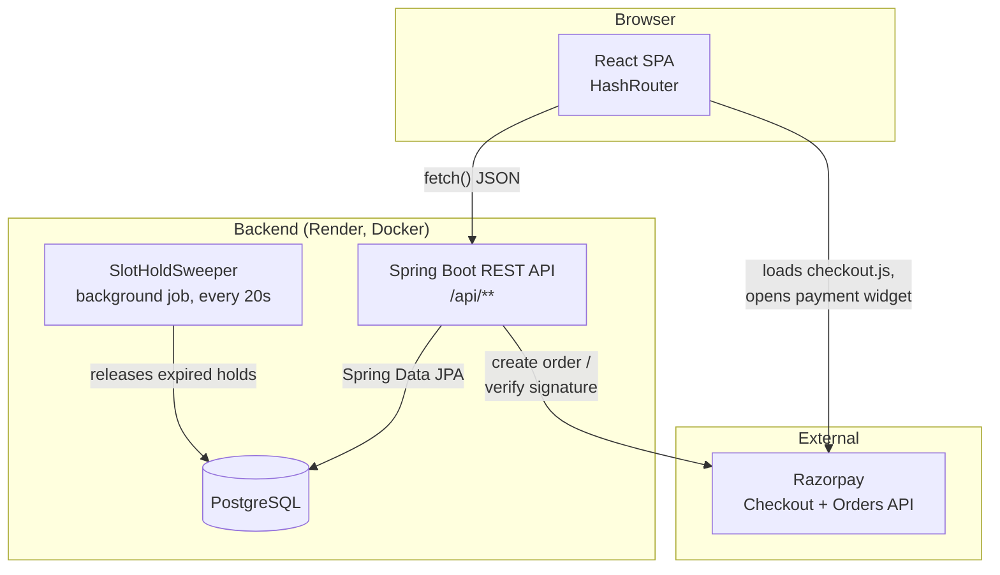
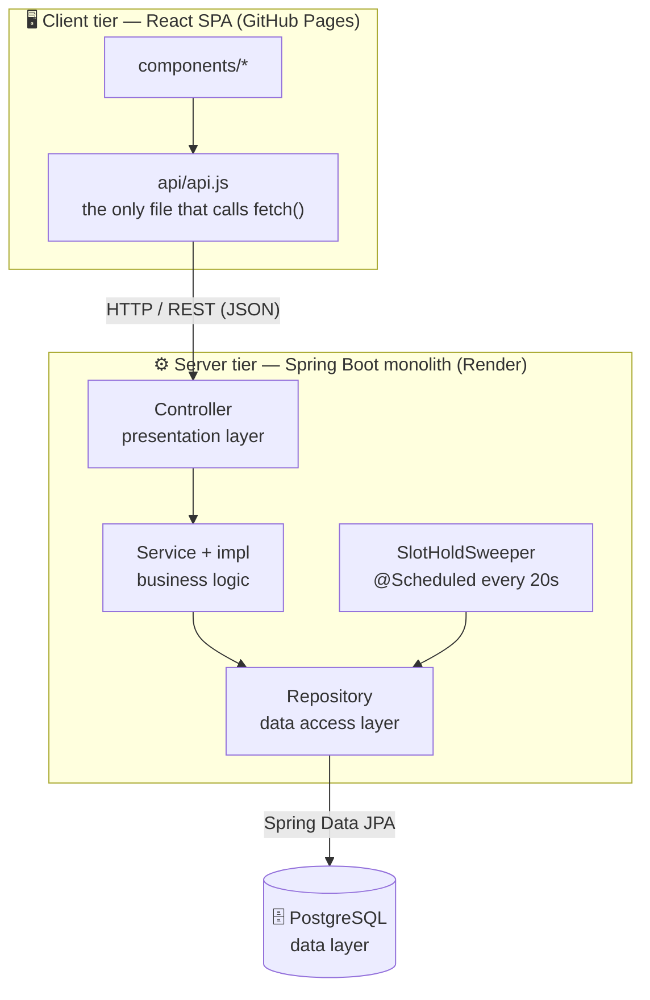
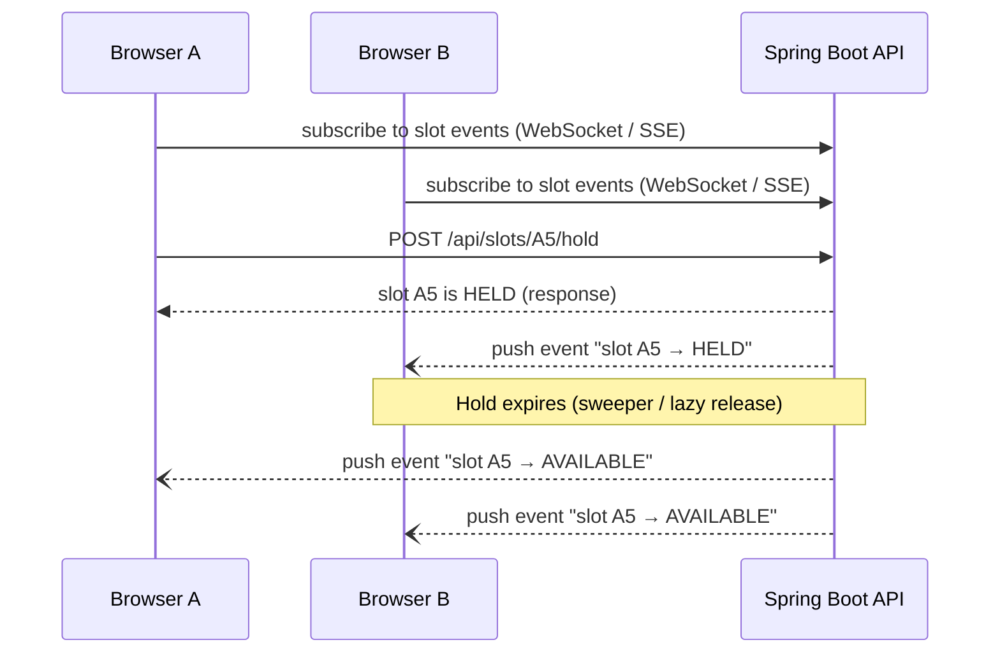
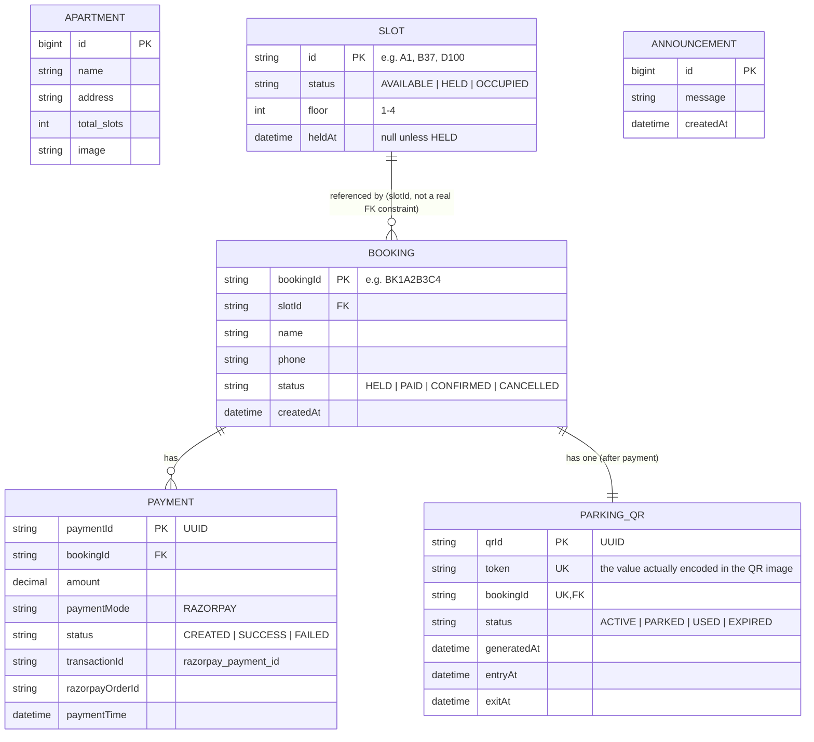
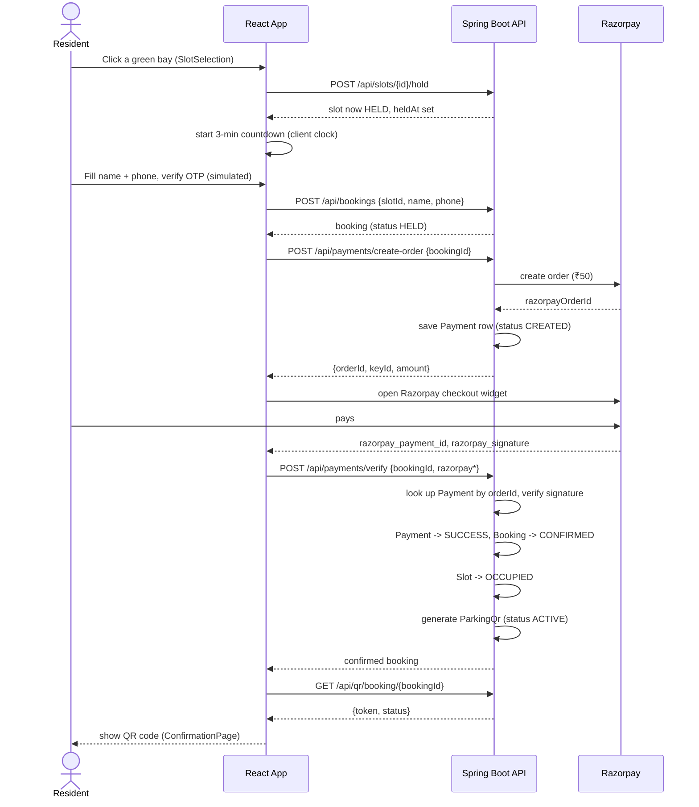
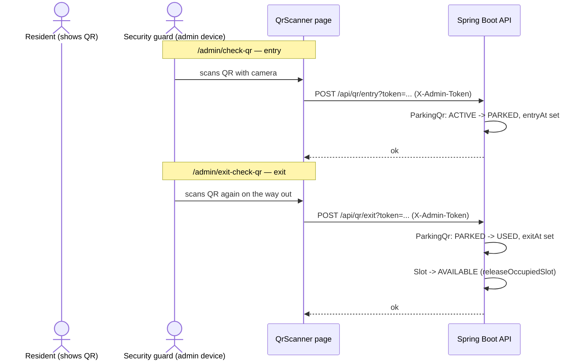
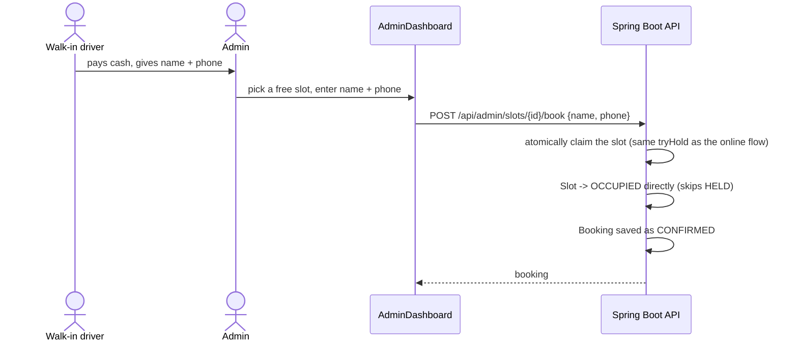
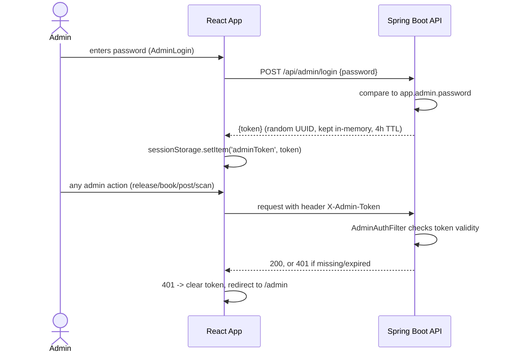
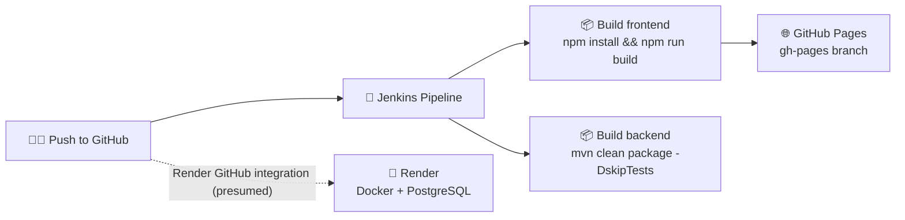

<div align="center">

# 🅿️ Smart Parking System — Apartment Edition

### Pick a bay in a 3D garage · Verify your phone · Pay online · Scan the QR at the gate

<br/>


<br/>

**A full-stack apartment parking reservation system.**
Residents pick a bay in an interactive 3D garage, verify their phone, pay online with Razorpay, and get a QR code that is scanned at the gate on the way in and out.
An admin panel lets staff book walk-in visitors, free up stuck bays, and post notices.

<br/>

[✨ Features](#-features) •
[🧰 Tech Stack](#-1-tech-stack) •
[🏗️ Architecture](#️-2-high-level-architecture) •
[🧱 Architectural Style](#-21-architectural-style-at-a-glance) •
[🗄️ Database](#️-4-database-schema) •
[🔄 Core Flows](#-6-core-flows) •
[⚠️ Limitations](#️-7-known-gaps--honest-limitations) •
[🚀 Run Locally](#-9-running-it-locally)

</div>

---

> [!NOTE]
> This README explains the stack, the architecture, what every file does, how data moves through the system, and how to run it locally — written so it can be presented as-is for a course review/demo.

---

## ✨ Features

| | Feature | Description |
|---|---|---|
| 🏢 | **Interactive 3D garage** | Three.js garage with 4 floors × 100 bays, live-updating every 3 seconds |
| ⏱️ | **3-minute slot hold** | Bay is reserved for you while you fill the form and pay; auto-released on expiry |
| 📱 | **Phone verification** | 6-digit OTP step in the booking form (currently simulated — see [§7](#️-7-known-gaps--honest-limitations)) |
| 💳 | **Online payments** | Razorpay order creation + server-side signature verification |
| 🔳 | **QR entry & exit** | Backend-generated QR scanned at the gate with a camera-based scanner |
| 🧾 | **PDF receipt** | Generated fully client-side with jsPDF |
| 🛡️ | **Admin panel** | Walk-in bookings, release stuck bays, post announcements, scan QR codes |
| 📢 | **Announcements** | Latest admin notice shown as a banner on the home page |
| 🔁 | **Dual hold expiry** | Lazy release on requests **plus** a background sweeper every 20s |

---

## 🧰 1. Tech stack

| Layer | Technology |
|---|---|
| 🎨 **Frontend** | React 18 (Create React App), React Router (`HashRouter`) |
| 🧊 **3D garage view** | Three.js (raw, not react-three-fiber) + `OrbitControls` |
| 📦 **Frontend libraries** | `qrcode.react` (render QR), `html5-qrcode` (camera scanning), `jsPDF` (receipt PDF) |
| ⚙️ **Backend** | Java 17, Spring Boot 3.3 (Web, Validation, Data JPA, Scheduling) |
| 🗄️ **Database** | PostgreSQL (production, hosted on Render) |
| 💰 **Payments** | Razorpay (`razorpay-java` SDK) — order creation + signature verification |
| 🔐 **Auth** | Custom lightweight admin auth (fixed password + in-memory token), **not** Spring Security |
| ☁️ **Hosting** | Backend: Render (Docker). Frontend: GitHub Pages (`gh-pages`) |
| 🔧 **CI/CD** | Jenkins pipeline (`Jenkinsfile`) — builds both apps, deploys frontend to GitHub Pages |

---

## 🏗️ 2. High-level architecture



> [!IMPORTANT]
> The frontend never talks to Razorpay's secret key directly — it only opens the Razorpay widget with an **order id** the backend created, then hands the resulting payment id/signature back to the backend, which is the only place that verifies them (see [§6.1](#61-online-booking-payment-and-qr-issuance)).

### 🧱 2.1 Architectural style at a glance

| Aspect | What was built |
|---|---|
| **Overall style** | **Client-Server**, with a RESTful API as the contract between the two sides |
| **Backend internal structure** | **Layered (N-tier) architecture** — Controller (presentation) → Service (business logic) → Repository (data access) → PostgreSQL (data layer) |
| **Deployment shape** | **Monolith** — one Spring Boot app, one deployable unit (not microservices) |
| **Frontend** | **Single Page Application (SPA)** — client-side routing (`HashRouter`), all views rendered in the browser |
| **"Live" updates** | **Client-side polling** (every 3 seconds), not server push |
| **Background work** | **Scheduled task** (`@Scheduled`), not event-driven |



> [!IMPORTANT]
> **Suggested wording for an SRS / report:**
> *"The system uses a two-tier client-server architecture: a React single-page application (client) communicates with a Spring Boot REST API (server) over HTTP. The server is the sole owner of application state and business rules, persisted in PostgreSQL, and supports multiple concurrent clients. Internally, the server follows a layered architecture (Controller → Service → Repository). Background slot-expiry cleanup is handled via a scheduled polling job rather than event-driven messaging."*

### 🤝 2.2 Why this is a Client-Server architecture

Client-server has a specific definition: **two separate, independently running programs** — a *client* that requests things and a *server* that provides them — talking over a network through a **defined interface**, where the **server owns the data and the logic** and the client only gets access through it. This project matches that point for point:

**1️⃣ Two genuinely separate programs, each with its own lifecycle**

The React app and the Spring Boot app aren't just two folders — they are two independent deployables, built separately, deployed separately, and running on separate hosts:

| | Frontend (client) | Backend (server) |
|---|---|---|
| **Build** | `npm run build` | `mvn package` |
| **Packaging** | Static files | Docker container (`Dockerfile`) |
| **Host** | GitHub Pages | Render |

Neither depends on the other being built with it. You could redeploy the backend ten times without ever touching the frontend, and vice versa — that independence is the first hallmark of client-server.

**2️⃣ They only talk through a defined interface — the REST API**

The client never reaches into the server's internals. Every single interaction goes through `api.js`, which calls HTTP endpoints like `POST /api/slots/{id}/hold` or `POST /api/payments/verify`. The frontend has zero knowledge of `SlotServiceImpl`, the JPA repositories, or the database — it only knows *"if I POST here with this JSON, I get that JSON back."* That API is the contract between client and server — the second hallmark.

**3️⃣ The server owns the data and the rules — the client can't bypass it**

The PostgreSQL database lives only on the backend. The browser can't query or write to it directly — it can only ask the server to act on its behalf. Critically, the **server enforces the rules**: `slotRepository.tryHold(...)` is an atomic conditional update, so if two browsers click the same bay at the same instant, only one wins. The client has no way to force that outcome, because it has neither the logic nor the database. That centralization of authority is exactly what client-server means.

**4️⃣ Request-response, not push — the client always initiates**

Every exchange starts with the client asking: `SlotSelection.jsx` polls `GET /api/slots` every 3 seconds; `PaymentPage.jsx` calls `POST /api/payments/verify` after Razorpay returns. The server never contacts the browser on its own — it only replies to requests it received.

**5️⃣ One server, many clients**

The backend isn't written for a single user — it assumes many browsers connect to the same server at once. That is exactly why:

- `tryHold` needs to be **atomic**
- `SlotHoldSweeper` exists as a **shared background job**
- admin tokens are tracked **centrally** in `AdminAuthService` rather than per browser

None of that machinery would be necessary if client and server were really one program — it exists specifically because many clients share one server's state.

### 🚫 2.3 Why this is *not* an Event-Driven Architecture (EDA)

> [!WARNING]
> Worth getting this right before presenting — a reviewer in a software-architecture course will very likely probe this claim.

**EDA** means components communicate by producing and consuming events through an event bus or message broker (Kafka, RabbitMQ, Spring's `ApplicationEventPublisher`, WebSockets/SSE, etc.). Producers don't know who is listening, and consumers react asynchronously whenever an event arrives. **Nothing in this system works that way:**

| Part of the system | How it actually works | Why that's not EDA |
|---|---|---|
| **Frontend → backend** | Synchronous REST over HTTP (`fetch()` calls in `api.js`) | Direct request/response, not a published event |
| **`SlotSelection.jsx` live updates** | Polls `GET /api/slots` every 3 seconds (`setInterval`) | Polling means the client keeps asking; event-driven means the server pushes when something happens — they are opposites |
| **`SlotHoldSweeper`** | `@Scheduled(fixedRate = 20_000)` timer job | It isn't triggered by a hold expiring; it wakes up every 20s and checks |
| **Razorpay integration** | Direct REST calls (create order, verify signature) | The system doesn't listen for a Razorpay webhook event either |
| **Messaging infrastructure** | None | No message broker, no internal event bus, no pub/sub, no WebSocket/SSE anywhere in the codebase |

### 🔮 2.4 Future enhancement — a genuinely event-driven piece

If a real event-driven component is wanted (as a "future enhancement" section, or to add before presenting), the natural candidate is **replacing the 3-second slot-status poll with WebSockets or Server-Sent Events (SSE)**:



The backend would push *"slot X is now HELD / AVAILABLE"* to every connected client the moment it happens, instead of every browser asking every 3 seconds. That would be real event-driven behavior, reduce needless traffic, and make the garage view update instantly.

---

## 📁 3. Repository structure

```
smart-parking-apartment/
├── Jenkinsfile                     # CI/CD: build both apps, deploy frontend to GitHub Pages
├── backend/
│   ├── Dockerfile                  # multi-stage build -> runs the Spring Boot jar
│   ├── pom.xml                     # Maven deps: web, data-jpa, validation, postgresql, razorpay-java
│   └── src/main/
│       ├── resources/
│       │   ├── application.properties
│       │   └── data.sql            # seeds 1 apartment + 400 slots (4 floors x 100)
│       └── java/com/smartparking/apartment/
│           ├── entity/             # JPA entities (DB tables)
│           ├── repository/         # Spring Data interfaces
│           ├── service/ + impl/    # business logic
│           ├── controller/         # REST endpoints
│           ├── dto/                # request/response shapes
│           ├── security/           # admin auth (password + token), no Spring Security
│           ├── config/             # CORS, Razorpay client bean
│           ├── scheduler/          # background hold-expiry sweep
│           └── exception/          # SlotUnavailableException
└── frontend/
    ├── package.json                # homepage set for GitHub Pages deploy
    └── src/
        ├── App.jsx                 # all routes + the state shared across the booking flow
        ├── api/api.js              # every backend call lives here — the only file that knows the API shape
        └── components/             # one file per page/widget (listed in §5)
```

---

## 🗄️ 4. Database schema



**📝 Notes**

- `SLOT.id` is also the display label (`A1`…`D100`) — there's no separate numeric primary key. `data.sql` seeds 100 slots per floor, all `AVAILABLE`:

  | Floor | Slot IDs |
  |:---:|:---:|
  | 1 | `A1` – `A100` |
  | 2 | `B1` – `B100` |
  | 3 | `C1` – `C100` |
  | 4 | `D1` – `D100` |

- `BOOKING.slotId` and `PAYMENT.bookingId` / `PARKING_QR.bookingId` are plain string columns, not JPA `@ManyToOne` relations — the services look rows up by id manually. Simple, but means there's no DB-level referential integrity between them.
- `SLOT.heldAt` is how a hold's 3-minute expiry is calculated: see [§6.4](#64-hold-expiry-the-3-minute-timer).

---

## 🖥️ 5. Frontend — every file and what it's for

| File | Role |
|---|---|
| `App.jsx` | Declares all routes and owns the three pieces of state shared across the booking flow: `selectedSlotId`, `booking`, `holdExpiresAt`. Passes them down as props — there's no Redux/Context, just prop drilling, which is fine at this size. |
| `api/api.js` | **The only file that calls `fetch()`.** Every component imports functions from here instead of building URLs itself. Also normalizes backend responses (e.g. lowercases `status` enums) so the rest of the app doesn't deal with Java-style `"AVAILABLE"` vs `"available"`. |
| `components/HomePage.jsx` | Landing page (video hero). Loads apartment info + a live free-slot count, and shows the latest admin announcement as a small banner. |
| `components/SlotSelection.jsx` | The Three.js 3D garage. Renders a 10×10 grid per floor, positioned by **parsing each slot's own number out of its id** (not array index — see the comment in the file; this was a real bug once, documented in the code). Clicking an available bay calls `holdSlot()`, starts the countdown, and polls `getSlots()` every 3s so other users' changes show up live. |
| `components/HoldCountdown.jsx` | Small reusable "Hold expires in mm:ss" chip, used on this page, `BookingForm`, and `PaymentPage`. Styled for dark backgrounds since all three usages sit on dark panels. |
| `components/BookingForm.jsx` | Two-step form: enter name/phone, then a 6-digit OTP. **The OTP is currently simulated client-side** (see [§7](#️-7-known-gaps--honest-limitations)) — no real SMS is sent. On success, calls `createBooking()` (persists a `HELD` booking row) and moves to `/pay`. |
| `components/PaymentPage.jsx` | Opens Razorpay's checkout widget via `createPaymentOrder()` → `window.Razorpay(...).open()` → `verifyPayment()`. Shows the live hold countdown; if it expires before payment, shows a takeover screen instead of silently failing later. |
| `components/ConfirmationPage.jsx` | Fetches the backend-generated QR (`getQrByBooking`) and renders it with `qrcode.react`, offers a PDF receipt download (`jsPDF`, fully client-side), and shows the phone number's other past bookings. |
| `components/AdminLogin.jsx` | Single password field → `adminLogin()` → stores the returned token in `sessionStorage`. |
| `components/AdminDashboard.jsx` | Three panels: walk-in booking form (`adminBookSlot`), a list of every held/occupied bay with a Release button (`adminReleaseSlot`), and the announcement composer/list. Also links to the two scanner pages. |
| `components/QrScanner.jsx` | Camera-based QR reader (`html5-qrcode`) used for **both** entry and exit — which mode it's in comes from a prop set by the route (`/admin/check-qr` vs `/admin/exit-check-qr`), so it's one component doing two jobs. Requires the admin token in `sessionStorage` (redirects to login otherwise). |

### 🧭 Routes (`App.jsx`)

| Path | Component | Who |
|---|---|---|
| `/` | `HomePage` | 🌍 Everyone |
| `/slots` | `SlotSelection` | 🌍 Everyone |
| `/book` | `BookingForm` | 🌍 Everyone |
| `/pay` | `PaymentPage` | 🌍 Everyone |
| `/confirmation` | `ConfirmationPage` | 🌍 Everyone |
| `/admin` | `AdminLogin` | 🔐 Admin |
| `/admin/dashboard` | `AdminDashboard` | 🔐 Admin (token required) |
| `/admin/check-qr` | `QrScanner` (entry mode) | 🔐 Admin (token required) |
| `/admin/exit-check-qr` | `QrScanner` (exit mode) | 🔐 Admin (token required) |

---

## 🔄 6. Core flows

### 6.1 Online booking, payment, and QR issuance



### 6.2 Gate entry/exit (QR scan)



> [!NOTE]
> A QR scanned out of order (e.g. exit before entry, or scanned twice) is rejected with a `400` — `QrServiceImpl` checks the current status before each transition.

### 6.3 Admin walk-in booking (no online flow)



This reuses the exact same atomic `tryHold` query the online flow uses, so an admin can't accidentally grab a bay a resident is mid-booking on.

> [!WARNING]
> This path does **not** call `qrService.generateQr()` — walk-in bookings don't currently get a QR code, so the exit-scan flow only applies to bookings made through the online payment flow.

### 6.4 Hold expiry (the 3-minute timer)

A held slot is freed back to `AVAILABLE` by **two independent mechanisms**, both driven by `app.slot.hold-minutes` (`3`):

1. **Lazy release** — every time `getAllSlots()` or `holdSlot()` runs, it first runs `releaseExpiredHolds(...)`, an `UPDATE` that flips any slot `HELD` longer than the cutoff back to `AVAILABLE`. Cheap, but only fires when someone happens to make a request.
2. **`SlotHoldSweeper`** — a `@Scheduled(fixedRate = 20_000)` job that runs the same release query every 20 seconds regardless of traffic, so a bay doesn't stay stuck held forever if nobody's tab is open.

On the frontend, `HoldCountdown` is a purely visual, client-side timer (`Date.now() + HOLD_MINUTES * 60000`) — it doesn't control real expiry, it just estimates it so the UI can warn the user and reroute them before the backend actually drops their hold.

> [!TIP]
> It deliberately does **not** parse the server's `heldAt` timestamp — see the comment in `SlotSelection.jsx`: Java's `LocalDateTime` serializes with no timezone marker, which `Date.parse` silently misreads as local time, so using the browser's own clock as the reference point avoids a timezone bug entirely.

### 6.5 Admin authentication



This is a deliberately simple scheme (see `security/AdminAuthService.java`'s own doc comment):

- 🔑 One shared password, no per-admin accounts
- 🧠 Tokens live only in server memory (lost on restart), with a 4-hour TTL
- 🧱 `AdminAuthFilter` is a plain `OncePerRequestFilter` registered only for `/api/admin/**` — **not** Spring Security
- ✈️ It explicitly lets `OPTIONS` requests through unchecked, because a browser's CORS preflight for a request carrying `X-Admin-Token` never includes that header itself; blocking it would make every admin POST/DELETE fail as a CORS error before the real request is even sent
- 🚪 **The one exception:** the QR entry/exit endpoints (`/api/qr/entry`, `/api/qr/exit`) sit under `/api/qr/**`, outside the filter's path, so `QrController` checks `adminAuthService.isValid(...)` manually instead

---

## ⚠️ 7. Known gaps / honest limitations

Worth knowing before a professor asks about them:

| # | Gap | Details |
|:---:|---|---|
| 1 | 📵 **OTP is simulated, not real SMS** | `BookingForm.jsx` calls `sendOtp()` / `verifyOtp()` in `api.js`, which generate and check a code entirely in the browser with a fake delay — no request reaches the backend. The backend *does* have a working `OtpController` (`POST /api/otp/send` / `/verify`) with matching logic already written in `api.js` and commented out — wiring up a real SMS provider (Twilio/MSG91) is a drop-in swap, not a redesign. |
| 2 | 💸 **Two payment paths exist** | `POST /api/payments` (`processDummyPayment`) is the original always-succeeds stub from before Razorpay was integrated. It's left in place but `PaymentPage.jsx` no longer calls it — the live path is `createPaymentOrder` + `verifyPayment` against Razorpay. |
| 3 | 🏢 **`GET /api/apartment` is an unused stub** | `ApartmentController` and `ApartmentServiceImpl.getApartmentDetails()` both return `null`. `HomePage.jsx` actually gets apartment info by importing a local `apartment.json` and merging in a live slot count — this endpoint was never wired up on the frontend side. |
| 4 | 🚶 **Walk-in bookings skip QR issuance** | See [§6.3](#63-admin-walk-in-booking-no-online-flow) — only online, Razorpay-paid bookings get a scannable QR right now. |
| 5 | 🔗 **No DB foreign keys** | Between `Booking.slotId` / `Payment.bookingId` / `ParkingQr.bookingId` and their parent rows — they're plain strings looked up manually in each service, not JPA relations. |

---

## 🚢 8. Deployment & CI/CD

| Part | How it's deployed |
|---|---|
| 🐳 **Backend** | Containerized with `backend/Dockerfile` (multi-stage: builds with Maven, runs on a slim JRE), deployed to **Render**, backed by a managed **PostgreSQL** instance (connection string in `application.properties`, overridden by Render's environment in production). |
| 🌐 **Frontend** | Built with `npm run build` and pushed to the `gh-pages` branch via the `gh-pages` npm package, served by **GitHub Pages** at the `homepage` set in `package.json`. |
| 🔧 **CI/CD** | A single `Jenkinsfile` at the repo root: checks out the repo, builds the frontend (`npm install && npm run build`) and backend (`mvn clean package -DskipTests`), then deploys the frontend build to GitHub Pages using a stored GitHub PAT. |
| 🛰️ **Backend deploy trigger** | The backend doesn't have an explicit deploy stage in the pipeline — Render deploys are presumably triggered separately (e.g. on push, via Render's own GitHub integration). |
| 🔒 **CORS** | `CorsConfig.java` allows exactly `http://localhost:3000` (local dev) and `https://ravi16329.github.io` (the deployed frontend). |



---

## 🚀 9. Running it locally

### 📋 Prerequisites

- ☕ Java 17 + Maven
- 🟢 Node.js + npm
- 🐘 A PostgreSQL instance
- 💳 A Razorpay **test-mode** key pair

### ⚙️ Backend

```bash
cd backend
# needs a Postgres instance — set its URL/credentials in
# src/main/resources/application.properties (or override via env vars),
# and set razorpay.key.id / razorpay.key.secret to a Razorpay test-mode key pair.
mvn spring-boot:run
```

### 🎨 Frontend

```bash
cd frontend
npm install
npm start
```

> [!TIP]
> By default the frontend's `api.js` points `BASE_URL` at the deployed Render backend — change it to `http://localhost:8080/api` to run fully locally against your own backend instance.

---

<div align="center">

### 🅿️ Smart Parking System — Apartment Edition

Built with ❤️ using React, Three.js, Spring Boot, PostgreSQL & Razorpay

⭐ If you found this project useful, consider giving it a star!

</div>
